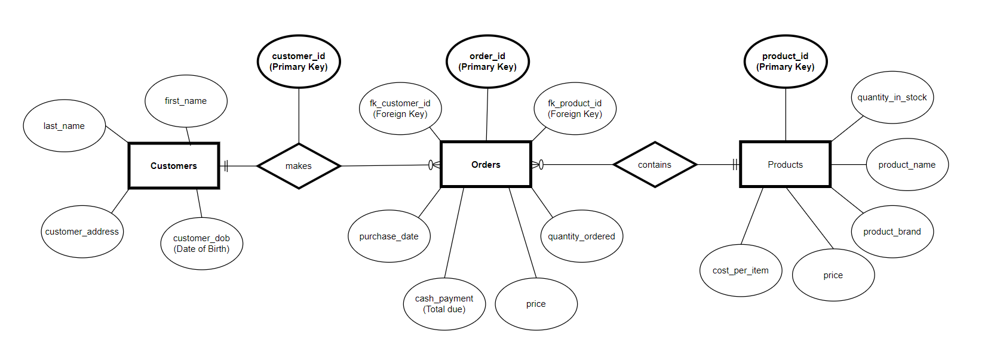

# Tuckshop 
## Application Overview
> Tuckshop is a web application for use by a tuck shop vendor for recording product sales. It is designed for a youth camp, where a customer list, as well as the stock list, are known. All tables accomodate the addition, updating and deletion of records - it is assumed that the tuck shop vendor will be the only user, so there is no restricted functionality.

> This database system logs basic information on customers (names, address, date of birth, etc), products (name, brand, price, etc), and orders (date, price, quantity, etc). The product ID and customer ID in the orders form are used to identify a unique customer and product for each order, allowing the three tables to be robustly connected. All of the tables in the databse allow for the creation, deletion and amending of records, and there are in-built logical restrictions on any changes that would compromise the integrity of the data.

> The tables are configured so that new orders automatically change the quantity of stock in the Products table by the amount ordered; deleted orders will automatically restore the stock levels by the amount ordred. Updating an order with a different product will act like the deletion of the previous order and the creation of a new order, which will be reflected in the orders and products tables. 

> It is not possible to delete customers and products listed in the Orders table. The forms are configured so that a product cannot be ordered successfully if the order price is different to the listed price, or if the total paid is equal to the price times the quantity ordered, and it isn't possible to order more than is in stock either. Duplicate additions to the Customers and Products tables are refused, although alternate spellings in the key fields will be accepted by the system.

## Setup
> The source code for the Tuckshop web application can be cloned from [this Github repository](https://github.com/RobLewisQA/TuckShop_Project). In order to run the application on Linux Ubuntu 18.04 on your localhost port, ensure that you have Python 3.6 or higher installed, as well as the python installer package, pip3. The following commands should be input in order into your Linux terminal:
1. source venv/bin/activate
2. pip3 install -r requirements.txt
3. python3 create.py
4. python3 app.py

>In order to post this web application live to the internet, ignore step 4 above and instead use the following commands:
4. pip3 install flask gunicorn
5. sudo apt install gunicorn3 -y
6. gunicorn3 --bind=0.0.0.0:[*INSERT YOUR PORT NUMBER*] app:app
## Technologies
#### Cloud Server Host:
> This web application was designed using the Google Cloud Platform as the host for both the compute virtual machine instance and MySQL database virtual machine instance. The GCP compute machine was developed on a Linux Ubuntu 18.04 bootdisk.
#### Database format:
> The database is a MySQL relational database integrated with SQLalchemy for reading from and writing to the database using python commands. The python Pandas library is also used to read and clean data from the MySQL database for output to HTML; the tables' HTML is generated using pandas methods for DataFrames.
#### Frontend script:
> The application uses the Flask web-development framework to allow python statements to manage HTML output for the URI routes specified in the routes file. 
#### Testing software:
> This application was tested using the flask-testing, pytest and pytest-cov python libraries. The unit and configuration testing thoughouly interrogates the read, create, update and delete functions, with coverage of 83% of the entire application.
> To replicate the testing, simply run steps 1. and 2. of the setup instructions, followed by: *pytest --cov=application*
#### Deployment software:
> The application was designed and tested for deployment using Jenkins to automate Linux command execution of virtual environment generation, dependencies installation and Gunicorn web-deployment. 
#### Continous Integration and Version Control:
> The source code for this application is maintained in a Github repository accessible [here](https://github.com/RobLewisQA/TuckShop_Project), and can be conncted to Jenkins for automatic continuous integration and deployment.

## Database Entity Relationship Diagram
> The database for Tuckshop is composed of 3 tables: Customers, Products and Orders. Each entry/row for each table has a unique ID value - the ID columns are the primary keys of their tables. The individual orders are connected to specific customers and products by foreign key relationships, denoted in the Orders table as fk_customer_id and fk_product_id. 

Colloquially, the tables are related such that a single order is made by a single customer for a single product item (order quantities may vary). One customer can make many orders, or none, and one product can be included in many orders or none. A visualisation of this information is show below:

## Risk Assessment
Description | Evaluation | Likelihood | Impact Level | Responsibility | Response | Control Mearues
| --- | --- | --- | --- | --- | --- | --- |
Application's virtual compute machine goes down | Application goes offline | Low | High | GCP | Spin up a new vm instance either in GCP or an alternative cloud provider and clone the Github repo to integrate with Jenkins | Keep an up-to-date source code on Github
Application's virtual MySQL machine goes down | Application becomes unusable | Low | High | GCP | Spin up a new vm instance in GCP and update the configurations with SQLAlchemy and the virtual compute machine | Keep a backup database
The Python language is updated to a new version | The application may not run if Flask and SQLAlchemy are not updated for compatibility | Medium | Medium | Developers | Run the application on Python 3 and phase in an updated version in CI | Keep a robust Github repo so that the source code can be continuously improved and use Jenkins to manage the integration and deployment
Versions of libraries are updated and compatability issues are not mitigated | Some aspects of the application may fail | Medium | High | Developers | Update the requirements.txt to specify the exact versions required | Keep track of planned updates to key libraries, and specify the versions of some of the key libraries required for function
The port that the application run on changes | The app stops working | Low | High | CI Engineers/Operators | Update the firewall settings in the cloud provider to allow a different port access | Use Jenkins to manage continuous integration in the app, and notify when there are launch issues

## Development workflow:
>To see a kanban Trello board of the development process workflow, click [here](https://trello.com/b/p2nBtOlV/tuck-shop-board)

## References:
##### Pandas integreation with SQLAlchemy and HTML - Eric Brown, 2018 accessed at https://pythondata.com/quick-tip-sqlalchemy-for-mysql-and-pandas/
##### HTML form creation - https://www.w3schools.com/html/html_forms.asp